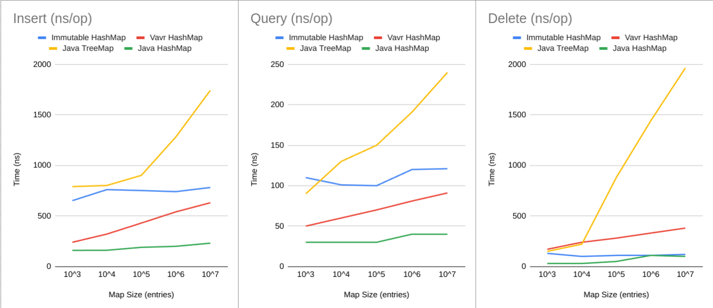

## Reinventing Immutable (Java)
### About
This project proudly believes in the holy gospel of **_Reinventing The Wheel ©_**. 

We will be implementing Immutable/Persistent data structures in Java and benchmarking performance. The goal of this 
project is to iteratively implement the `HashMap`, `LinkedList`, and `Vector` data structures. 

### Disclaimer
Any work you find in this package is strictly made for educational purposes and is not intended for any form 
of prod adoption. Use at your own discretion! 

Just like my new years resolutions, this repository is still a 🚨 🚨 **~~ _Work ~~ In ~~ Progress_ ~~** 🚨 🚨

## Immutable Hash Map
### Introduction
An immutable/persistent HashMap is a map data structure that allows users to carry out transformations without mutating 
existing references of the class. This allows for efficient data sharing, thread safety, and reduction in 
side-effects. 

Our implementation will generally try to follow the ideas set forth in the paper on Hash Array Map Tries 
(HAMT) by Phil Bagwell [[Link](https://lampwww.epfl.ch/papers/idealhashtrees.pdf)]. 

### Benchmarks

All measurements reflect p50(median) runtimes over a sample size of `100,000` operations per test. Tests were run 
comparing our implementation of the `Immutable HashMap` against the `Vavr HashMap`, `Java TreeMap`, and `Java HashMap`.

- `Vavr HashMap` - [Vavr](https://vavr.io/) is a functional library for Java that provides a highly optimized implementation of the 
persistent HashMap that we are implementing in this repository. This will be used as a baseline to compare against our 
implementation.
- `Java TreeMap` - TreeMap from the Java Standard Library implements a self-balancing Red-Black tree.
- `Java HashMap` - This is the Java Standard Library implementation of a HashMap.

Looking at maps containing 10^7 entries, our implementation of the Immutable HashMap outperforms the TreeMap by **2x** for 
insertions, **2x** for queries, and **16x** for deletions. This is expected as TreeMap has logarithmic complexity for 
each operation.

While the `Vavr HashMap` and `Java HashMap` outperform our implementation for insertions and queries, we should note 
that they follow a constant (amortized) runtime complexity. While the operations in the Immutable HashMap are 
technically logarithmic (O(log32n)), the wide branching factor (32 branches) make it a very shallow tree 
with a maximum depth of up to 7 levels while still allowing for an effective distribution strategy to achieve close to 
constant time for each operation.

The `Vavr HashMap` is a more optimized implementation of the Immutable HashMap in Java, and outperforms our
implementation for insertions and queries. Interestingly enough, our implementation seems to win out in deletions. 
It's possible that Vavr has more robust compaction strategies than our implementation, and is worth looking into in 
the future. 

All benchmarking code can be found [here](src/test/java/benchmarks/map).
